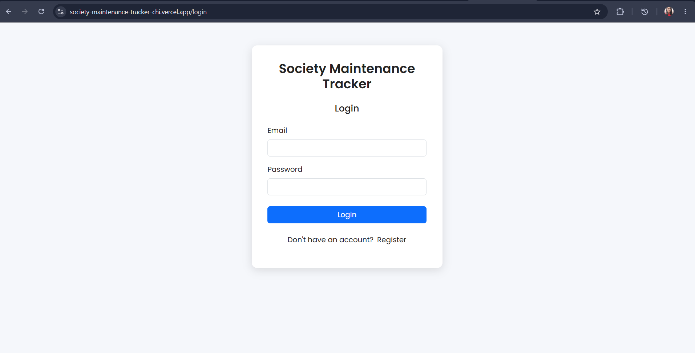
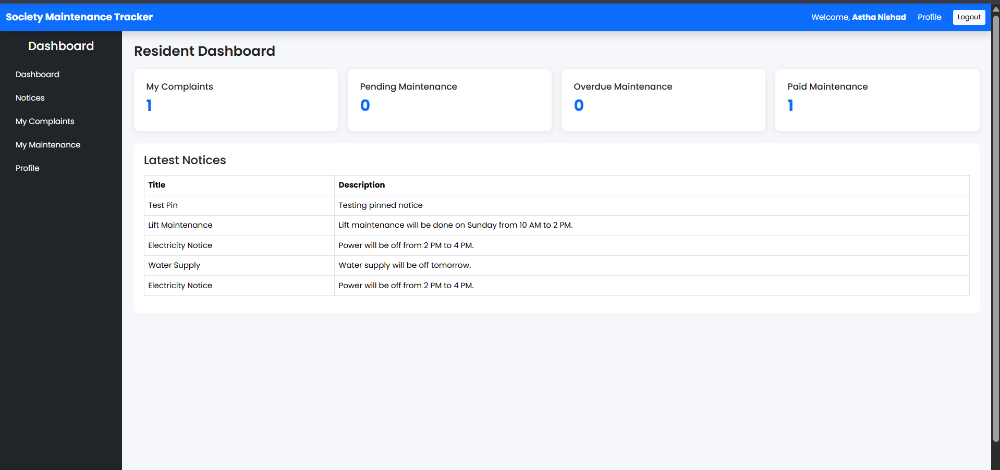
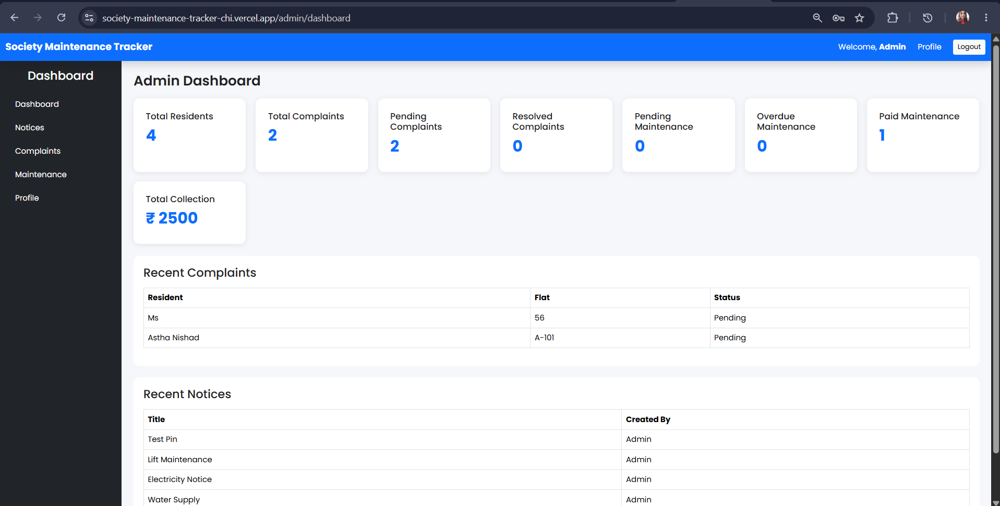
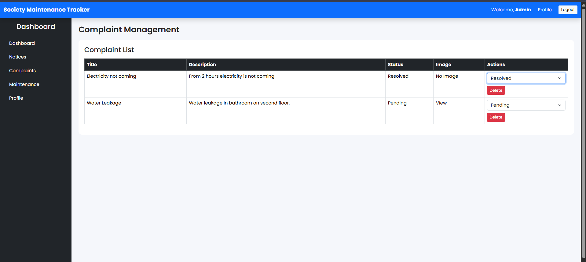

<div align="center">

# 🏢 Society Maintenance Tracker

### A Full Stack MERN Web Application for Efficient Society Complaint Management


</div>

---

# 📖 Overview

Society Maintenance Tracker is a Full Stack MERN application that helps residents and administrators manage society complaints efficiently.

Residents can register, log in, submit complaints, and track their complaint status, while administrators can securely manage users and update complaint statuses through a dedicated dashboard.

---

# ✨ Features

| Resident | Administrator |
|-----------|---------------|
| Register & Login | Secure Admin Login |
| Raise Complaint | View All Complaints |
| View Complaint Status | Update Complaint Status |
| Update Profile | Manage Complaint Records |
| Secure Authentication | Dashboard Access |

---

# 🛠 Tech Stack

| Category | Technologies |
|----------|--------------|
| Frontend | React.js, Vite, HTML5, CSS3, JavaScript, Axios |
| Backend | Node.js, Express.js |
| Database | MongoDB Atlas, Mongoose |
| Authentication | JWT, bcrypt.js |
| API Testing | Postman |
| Version Control | Git & GitHub |
| Deployment | Vercel (Frontend), Render (Backend) |

---

# 📂 Project Structure

```text
Society-Maintenance-Tracker
│
├── client/
│   ├── public/
│   ├── src/
│   ├── package.json
│   ├── vite.config.js
│   └── vercel.json
│
├── server/
│   ├── config/
│   ├── controllers/
│   ├── middleware/
│   ├── models/
│   ├── routes/
│   ├── services/
│   ├── app.js
│   ├── server.js
│   └── package.json
│
├── README.md
├── package.json
└── .gitignore
```

---

# 🚀 Installation

### Clone Repository

```bash
git clone https://github.com/YOUR_USERNAME/Society-Maintenance-Tracker.git
```

### Install Dependencies

#### Client

```bash
cd client
npm install
```

#### Server

```bash
cd server
npm install
```

---

# ▶️ Run the Application

### Start Backend

```bash
cd server
npm run dev
```

### Start Frontend

```bash
cd client
npm run dev
```

---

# 🔐 Environment Variables

Create a `.env` file inside the **server** folder.

```env
PORT=5000
MONGO_URI=your_mongodb_connection_string
JWT_SECRET=your_secret_key
```

| Variable | Description |
|----------|-------------|
| PORT | Server Port |
| MONGO_URI | MongoDB Atlas Connection String |
| JWT_SECRET | Secret Key for Authentication |

---

# 🌐 Live Demo

| Service | URL |
|---------|-----|
| Frontend | https://vercel.com/astha-nishad/society-maintenance-tracker |
| Backend API | https://society-maintenance-tracker-ityd.onrender.com |

---

# 📸 Screenshots

| Login Page | Resident Dashboard |
|------------|--------------------|
|  |  |

| Admin Dashboard | Complaint Management |
|-----------------|----------------------|
|  |  |

---

# 🔮 Future Enhancements

- 💳 Maintenance Payment Module
- 📢 Society Notice Board
- 📧 Email Notifications
- 🚪 Visitor Management
- 📊 Admin Analytics Dashboard
- 🔍 Complaint Search & Filter
- 📱 Mobile Responsive Improvements

---

# 👩‍💻 Developer

**Astha Nishad**

**B.Tech – Computer Science & Engineering (Data Science)**

---

## 🎯 Key Highlights

- JWT-based Authentication
- Role-based Access Control (Admin & Resident)
- RESTful API Integration
- MongoDB Atlas Database
- Responsive User Interface
- MERN Stack Architecture
- Frontend deployed on Vercel
- Backend deployed on Render

